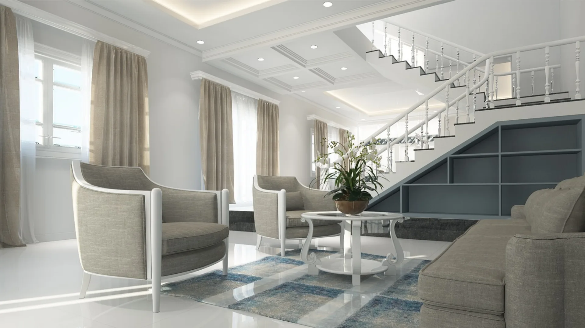

# PARAGON DEVELOPMENT — Ultra-Luxury Real Estate

**Slug:** `20260228_real-estate-development`
**Created:** 2026-02-28
**Tier:** Free
**Status:** PUBLISHED

## Brand Overview

**PARAGON DEVELOPMENT** (Paragon Luxury Development Group) is an ultra-luxury residential real estate developer and architectural patron with a 52-year legacy. Founded in New York in 1972, the company has developed $12 billion in real estate across 48 landmark buildings in 12 global cities.

**Tagline:** "Redefining luxury living, one landmark at a time."

## Design Specifications

| Property | Value |
|---|---|
| Hero Layout | TYPE D — Portrait + Stats Grid |
| Color Palette | P8 — Onyx Stone |
| Font Pair | F7 — Libre Baskerville + Source Sans 3 |
| Animation | A1 Standard (y:24, dur:1.1, stagger:0.10) |

## Color Palette — P8 Onyx Stone

```css
--bg: #181818
--surface: #222222
--surface2: #2A2A2A
--accent: #B0B0C0
--accent-light: #D0D0DC
--accent-dark: #909098
--ivory: #F0EDE8
--smoke: #C0B8B0
--muted: #808078
--border: #2E2E2E
```

## Pages

1. **index.html** — Homepage with TYPE D hero (Portrait+Stats grid), philosophy, featured property, portfolio teaser, process overview, testimonials, gallery, CTA
2. **about.html** — Company history (1972–2026), leadership team, awards, mission
3. **collection.html** — Portfolio page with filter by city, featured property, 9 property cards, city stats
4. **process.html** — 7-phase development methodology with image panels, standards, delivery timeline
5. **contact.html** — Split-panel contact with form + office details, directors section, privacy commitment

## Hero Implementation — TYPE D

```html
<section id="hero">
  <!-- LEFT: full-height architectural image -->
  <div class="hero-image-pane">
    
  </div>
  <!-- RIGHT: stats + headline -->
  <div class="hero-content-pane">
    <h1>REDEFINING LUXURY LIVING</h1>
    <!-- 4 stats: $12B / 48 / 12 / 1972 in Libre Baskerville -->
  </div>
</section>
```

CSS: `display: grid; grid-template-columns: 1.3fr 0.7fr`

## Required Images

```
images/
  hero-1.webp    — Primary architectural exterior / hero facade
  hero-2.webp    — Signature tower / building detail
  hero-3.webp    — Terrace / panoramic view
  hero-4.webp    — Architectural interior / facade detail
  product-1.webp — Property card: 740 Fifth Avenue
  product-2.webp — Property card: Paragon Mayfair, London
  product-3.webp — Property card: Paragon Marina Estate, Dubai
  product-4.webp — Property card: Paragon Roppongi, Tokyo
  ambient-1.webp — Lobby / materials / atrium
  ambient-2.webp — Penthouse interior
  ambient-3.webp — Members club / amenity space
```

## CDN Dependencies

- GSAP 3.12.2 + ScrollTrigger — cdnjs.cloudflare.com
- Swiper 11 — cdn.jsdelivr.net
- Google Fonts: Libre Baskerville + Source Sans 3

## GSAP Rules Applied

- All `gsap.from()` calls include `immediateRender: false` at TOP LEVEL
- No CSS `opacity: 0` on content elements
- Scroll indicator: preloader onComplete AND setTimeout(4000)
- Philosophy grid: `display: grid; grid-template-columns: repeat(3, 1fr)`
- Collection grid: `overflow: visible`
- Footer: `background: var(--bg)` only
- SplitText polyfill inline before Swiper
